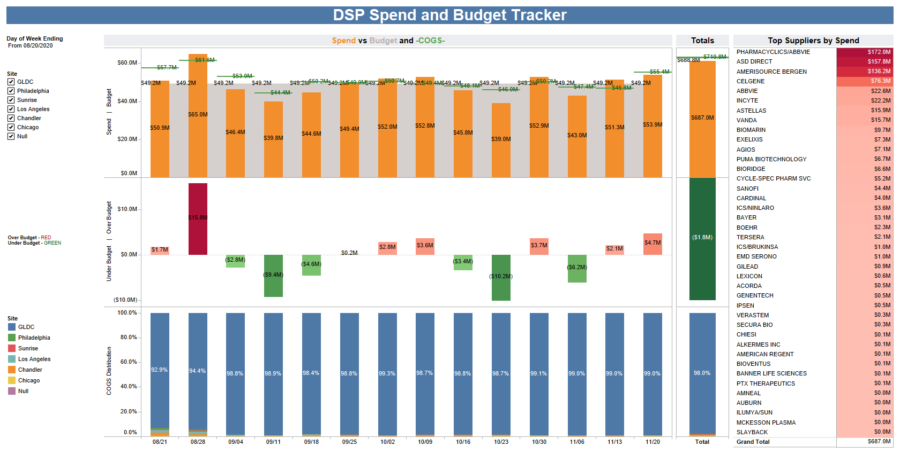
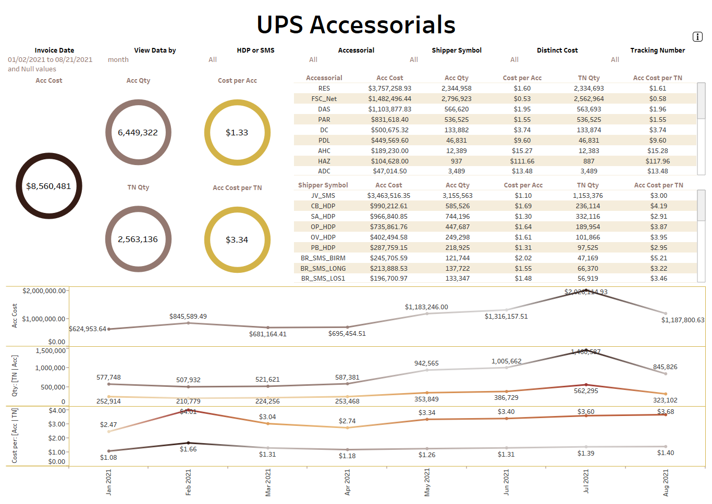
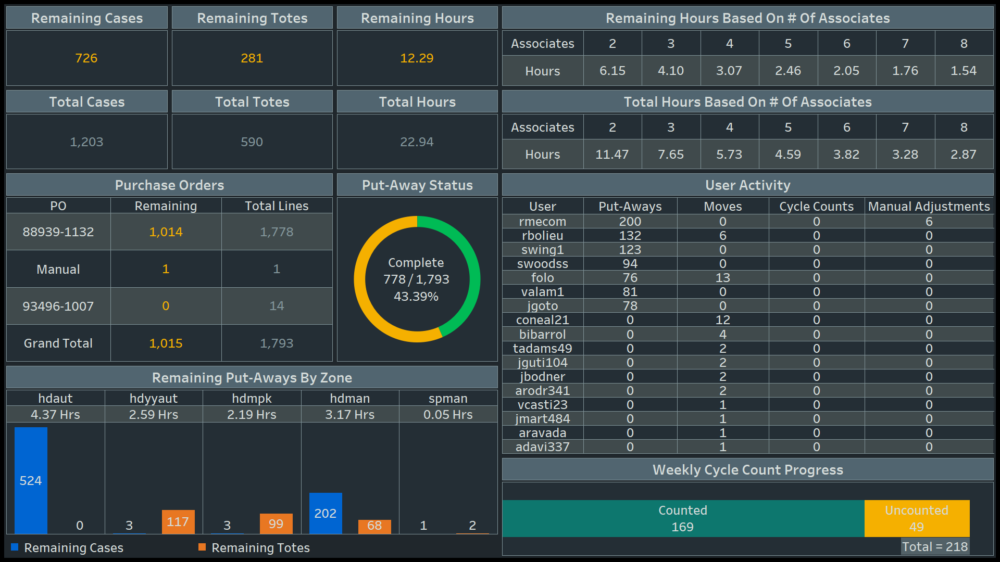

```{r setup, include=FALSE}
knitr::opts_chunk$set(echo = FALSE)
```

## Overview
This document provides snapshots of dashboards I created for previous organizations at different points in time. These snapshots serve as reference examples and do not represent the final products, as ownership of the final dashboards belongs to the respective organizations. Below, you will find more details about each snapshot.

### Table of Contents
- [DSP Spend and Budget Tracker]
- [UPS Accessorials Dashboard]
- [SA WMS Dashboard]

## DSP Spend and Budget Tracker
The DSP Spend and Budget Tracker was the very first Tableau Dashboard I ever created for an organization. Our Senior Director of Operations and Procurement reached out to me one day looking for a tool to help the leadership team track Spend versus the Budget and COGS across 7 different pharmacies. I whipped up a prototype within the next day or two, presented it to the team, and this became the go-to tool that leadership used to make budget adjustments across different sites.
```{r}

```

## UPS Accessorials Dashboard
The UPS Accessorials Dashboard was an exploratory dashboard I created to help our Logistics Managers track Accessorial Spend, Quantity, Cost Per, among other things. Accessorials are essentially additional charges not included in regular transportation service, such as Address Correction. While not immediately visible in view of this snapshot, this dashboard helped us detect that we were overcharged approximately $185K back in February 2021 for Additional Handling Charges. Upon bringing this to the carrier's attention, they investigated the error and ultimately credited us the $185K.
```{r}

```

## SA WMS Dashboard
The SA WMS Dashboard was a tool I created to assist our Operations leaders on the floor of each pharmacy in gaining better visibility into their staff's productivity and determining if they could reallocate resources to other areas of the pharmacy as needed. This specific snapshot reflects only one site at one point in time. However, I replicated the process across 6 other pharmacies, and these dashboards would update daily, displaying on the big screens within each pharmacy. This way, not only did the operations leaders benefit from the visibility, but everyone in the pharmacy could see the information.
```{r}

```
